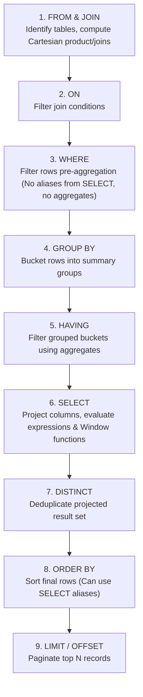

# Module 01: DBMS — SQL Query Execution Order & Joins

---

## 1. Logical SQL Query Execution Order

In standard programming languages (like Python or C++), code executes imperatively from top to bottom. In SQL (a declarative language), **written syntax differs fundamentally from logical execution order**. Understanding this sequence is essential for diagnosing query semantics, variable scoping, and why certain clauses cannot access aliases or aggregations.

### 1.1 Written Order vs. Logical Execution Order

```
WRITTEN SYNTAX ORDER                     LOGICAL EXECUTION ORDER
1. SELECT                                1. FROM & JOINs
2. DISTINCT                              2. ON (Join Predicates)
3. FROM                                  3. WHERE (Row Filtering)
4. JOIN ... ON                           4. GROUP BY (Aggregation Grouping)
5. WHERE                                 5. WITH CUBE / WITH ROLLUP
6. GROUP BY                              6. HAVING (Group Filtering)
7. HAVING                                7. SELECT (Column Projection / Expressions)
8. ORDER BY                              8. DISTINCT (Duplicate Removal)
9. LIMIT / OFFSET                        9. ORDER BY (Sorting Output)
                                        10. LIMIT / OFFSET / TOP (Pagination)
```

### 1.2 Step-by-Step Logical Pipeline



### 1.3 Common Pitfalls & Explanations

#### Trap 1: Why can't we use a column alias defined in `SELECT` inside the `WHERE` clause?
```sql
-- FAILS IN SQL!
SELECT salary * 12 AS annual_salary
FROM employees
WHERE annual_salary > 500000;
```
- **Reason**: The `WHERE` clause (Step 3) is evaluated **before** `SELECT` (Step 6). When the engine checks `annual_salary`, that column alias does not exist yet in the evaluation pipeline.
- **Solution**:
  1. Repeat the expression: `WHERE salary * 12 > 500000`
  2. Use a CTE (Common Table Expression) or Subquery:
     ```sql
     WITH CalculatedSalaries AS (
         SELECT employee_id, salary * 12 AS annual_salary
         FROM employees
     )
     SELECT * FROM CalculatedSalaries WHERE annual_salary > 500000;
     ```

#### Trap 2: Why can we use column aliases in `ORDER BY`?
```sql
-- WORKS PERFECTLY!
SELECT department_id, AVG(salary) AS avg_sal
FROM employees
GROUP BY department_id
ORDER BY avg_sal DESC;
```
- **Reason**: `ORDER BY` (Step 8) executes **after** `SELECT` (Step 6). By the time sorting occurs, all expressions and column aliases have been materialized.

#### Trap 3: `WHERE` vs `HAVING` — What happens under the hood?
| Feature | `WHERE` | `HAVING` |
| :--- | :--- | :--- |
| **Pipeline Stage** | Step 3 (Pre-aggregation) | Step 5 (Post-aggregation) |
| **Scope of Filtering** | Individual table rows | Aggregated groups |
| **Aggregate Functions** | **Forbidden** (`WHERE AVG(salary) > 50` is invalid) | **Allowed** (`HAVING COUNT(*) > 5`) |
| **Performance Impact** | Fast (reduces dataset before costly group/sort) | Slower if used for row-level filters |
| **Index Usage** | Can leverage B-Tree indexes directly | Cannot leverage indexes on aggregate results |

> [!TIP]
> **Performance Best Practice**: Always filter non-aggregated conditions in `WHERE` rather than `HAVING`.
> Filtering early in `WHERE` eliminates rows before they enter memory-heavy grouping buckets.

---

## 2. SQL Joins: Comprehensive Taxonomy & Deep Dive

A JOIN operation combines columns from one or more tables based on a related column between them.

### Sample Schema for Demonstration
Assume two tables: `Employees` and `Departments`.

**Table: `Employees`**
| emp_id | emp_name | dept_id | salary |
| :--- | :--- | :--- | :--- |
| 1 | Alice | 10 | 90000 |
| 2 | Bob | 20 | 80000 |
| 3 | Charlie | 10 | 85000 |
| 4 | David | NULL | 60000 |

**Table: `Departments`**
| dept_id | dept_name |
| :--- | :--- |
| 10 | Engineering |
| 20 | Marketing |
| 30 | Human Resources |

---

### 2.1 INNER JOIN
Returns only records where there is an exact match in **both** tables.
```sql
SELECT e.emp_id, e.emp_name, d.dept_name
FROM Employees e
INNER JOIN Departments d
    ON e.dept_id = d.dept_id;
```
**Output:**
| emp_id | emp_name | dept_name |
| :--- | :--- | :--- |
| 1 | Alice | Engineering |
| 2 | Bob | Marketing |
| 3 | Charlie | Engineering |

*Notice*: David (`dept_id = NULL`) and Human Resources (`dept_id = 30`) are excluded because no match exists.

---

### 2.2 LEFT (OUTER) JOIN
Returns **all** records from the left table (`Employees`), and matched records from the right table (`Departments`). If no match exists, columns from the right table contain `NULL`.

```sql
SELECT e.emp_id, e.emp_name, d.dept_name
FROM Employees e
LEFT JOIN Departments d
    ON e.dept_id = d.dept_id;
```
**Output:**
| emp_id | emp_name | dept_name |
| :--- | :--- | :--- |
| 1 | Alice | Engineering |
| 2 | Bob | Marketing |
| 3 | Charlie | Engineering |
| 4 | David | *NULL* |

---

### 2.3 RIGHT (OUTER) JOIN
Returns **all** records from the right table (`Departments`), and matched records from the left table (`Employees`). Unmatched left records return `NULL`.

```sql
SELECT e.emp_name, d.dept_id, d.dept_name
FROM Employees e
RIGHT JOIN Departments d
    ON e.dept_id = d.dept_id;
```
**Output:**
| emp_name | dept_id | dept_name |
| :--- | :--- | :--- |
| Alice | 10 | Engineering |
| Charlie | 10 | Engineering |
| Bob | 20 | Marketing |
| *NULL* | 30 | Human Resources |

---

### 2.4 FULL (OUTER) JOIN
Returns all records when there is a match in either left or right table. Unmatched attributes from either side become `NULL`.

```sql
SELECT e.emp_name, d.dept_name
FROM Employees e
FULL OUTER JOIN Departments d
    ON e.dept_id = d.dept_id;
```
*Note for MySQL users*: MySQL does not natively support `FULL OUTER JOIN`. You emulate it using `UNION`:
```sql
SELECT e.emp_name, d.dept_name
FROM Employees e LEFT JOIN Departments d ON e.dept_id = d.dept_id
UNION
SELECT e.emp_name, d.dept_name
FROM Employees e RIGHT JOIN Departments d ON e.dept_id = d.dept_id;
```

---

### 2.5 CROSS JOIN (Cartesian Product)
Pairs every row of the left table with every row of the right table.
If Table A has $N$ rows and Table B has $M$ rows, the result has $N \times M$ rows.

```sql
SELECT e.emp_name, d.dept_name
FROM Employees e
CROSS JOIN Departments d;
```
**When is this used in the real world?**
1. Generating permutations (e.g., all combinations of T-shirt sizes and colors).
2. Generating date grids/calendars to join with sparse transactional data.

---

### 2.6 SELF JOIN
A table joined with itself. Frequently used for hierarchical or sequential relationships (e.g., Employee -> Manager, or finding consecutive transactions).

**Table: `Staff`**
| emp_id | name | manager_id |
| :--- | :--- | :--- |
| 101 | Sarah (CEO) | NULL |
| 102 | John | 101 |
| 103 | Emily | 101 |
| 104 | Michael | 102 |

**Query: List every employee along with their manager's name:**
```sql
SELECT 
    e.name AS employee_name,
    COALESCE(m.name, 'Top Executive / No Manager') AS manager_name
FROM Staff e
LEFT JOIN Staff m
    ON e.manager_id = m.emp_id;
```

---

### 2.7 Anti-Joins & Semi-Joins

#### Anti-Join: "Find all departments that currently have ZERO employees"
```sql
-- Approach 1: LEFT JOIN with IS NULL filter (Classic Anti-Join)
SELECT d.dept_id, d.dept_name
FROM Departments d
LEFT JOIN Employees e
    ON d.dept_id = e.dept_id
WHERE e.emp_id IS NULL;

-- Approach 2: NOT EXISTS (Highly recommended for clarity and optimizer efficiency)
SELECT d.dept_id, d.dept_name
FROM Departments d
WHERE NOT EXISTS (
    SELECT 1 FROM Employees e WHERE e.dept_id = d.dept_id
);
```

> [!WARNING]
> **The `NOT IN` with NULL Pitfall**:
> If you write `WHERE dept_id NOT IN (SELECT dept_id FROM Employees)`, and the subquery returns even a single `NULL`, the entire `NOT IN` clause evaluates to `UNKNOWN` and returns **0 rows**!
> Always prefer `NOT EXISTS` over `NOT IN` when dealing with nullable foreign keys.

---

## 3. Physical Join Algorithms (Engine Internals)

How does the database execute joins on disk and in memory?

| Join Algorithm | Mechanism | Time Complexity | Best Used When |
| :--- | :--- | :--- | :--- |
| **Nested Loop Join** | For every outer table row, scan the inner table. | $O(N \times M)$ (or $O(N \log M)$ with inner index) | One table is very small, and the inner table has an indexed join key. |
| **Hash Join** | Builds an in-memory hash table on the smaller table, then streams and probes the larger table. | $O(N + M)$ | Large, unsorted datasets joining on equality (`=`) without indexes. Requires sufficient RAM. |
| **Merge Join (Sort-Merge)** | Sorts both tables on the join key (if not already sorted by an index), then scans both in parallel like two pointers. | $O(N \log N + M \log M)$ | Both tables are large and already sorted on the join key, or join condition includes inequality (`<`, `>=`). |

---

## 4. Query Analysis: Aggregation in WHERE vs HAVING

Consider the invalid query:
```sql
-- Syntax Error!
SELECT dept_id, COUNT(*) FROM emp WHERE COUNT(*) > 5 GROUP BY dept_id;
```

### Technical Root Cause:
The query fails due to SQL's logical execution pipeline: `FROM` $\to$ `WHERE` $\to$ `GROUP BY` $\to$ `HAVING` $\to$ `SELECT`.
1. The `WHERE` clause executes at Step 2 (prior to row grouping). Because grouped buckets do not yet exist, aggregate functions like `COUNT(*)` cannot be evaluated.
2. Group filtering must occur in the `HAVING` clause, which executes at Step 4 (after grouping):
```sql
SELECT dept_id, COUNT(*)
FROM emp
GROUP BY dept_id
HAVING COUNT(*) > 5;
```
This ensures the engine first partitions rows into department buckets and subsequently filters out buckets containing 5 or fewer rows.
