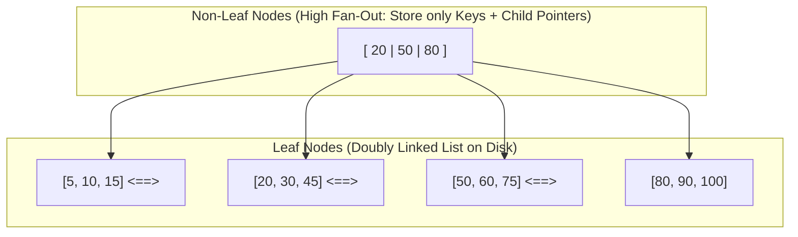

# Module 01: DBMS — Indexing Internals & Query Optimization

---

## 1. What is an Index & Why Do We Need It?

Without an index, finding a specific record in a database table requires a **Full Table Scan ($O(N)$)**: every single page on disk must be read into memory from start to finish. For a 10-million-row table, this can take seconds to minutes.

An **Index** is a specialized auxiliary data structure that holds sorted keys pointing to physical row locations, reducing lookup time from $O(N)$ to $O(\log N)$.

---

Indexes are categorized into two foundational physical and structural architectures:

```
CLUSTERED INDEX:
[Root / Intermediate Nodes (Index Page)]
                 |
     [Leaf Nodes = The Actual Data Rows Themselves!]
     (Ordered physically on disk by Primary Key)

NON-CLUSTERED INDEX (Secondary Index):
[Root / Intermediate Nodes]
                 |
     [Leaf Nodes = (Index Key + Row Locator / Clustered Key)]
                 | (Requires a Bookmark Lookup / Secondary Hop)
     [Clustered Index / Data Heap]
```

### Detailed Comparison Table:
| Feature | Clustered Index | Non-Clustered (Secondary) Index |
| :--- | :--- | :--- |
| **Physical Storage** | Dictates the physical order of data on disk. | Stored in a completely separate physical location. |
| **Count per Table** | **Exactly 1** per table (you can only sort disk blocks one way). | **Multiple** (e.g., 5 to 10+ depending on database engine). |
| **Leaf Node Content** | Contains the **actual data rows** with all columns. | Contains the **indexed column values + a pointer (or PK)** to the row. |
| **Default Creation** | Automatically created when you declare a `PRIMARY KEY`. | Created explicitly via `CREATE INDEX idx_name ON table(col)`. |
| **Lookup Cost** | Direct lookup ($O(\log N)$). | May require an additional lookup (Bookmark Lookup) to fetch non-indexed columns. |

---

## 3. Storage Engine Internals: Why B+ Trees?

Why do RDBMS engines (MySQL InnoDB, PostgreSQL, Oracle, SQL Server) universally use **B+ Trees** rather than Binary Search Trees (BST), Red-Black Trees, or standard B-Trees?



### The 4 Architectural Reasons:
1. **Disk Block / Page Alignment**:
   Disk reads occur in blocks (typically 4 KB, 8 KB, or 16 KB in InnoDB). A binary tree node stores 1 key and 2 pointers (~32 bytes), wasting 99% of a disk page read! A B+ Tree node has a fan-out of hundreds or thousands of keys per page, maximizing disk I/O efficiency.
2. **Shallow Tree Depth ($O(\log_B N)$)**:
   With a fan-out $B = 1000$:
   - Level 1 (Root): 1,000 keys
   - Level 2: 1,000,000 keys
   - Level 3: 1,000,000,000 keys (1 Billion rows accessed in just **3 disk I/Os**!).
3. **B+ Tree vs. B-Tree**:
   - In a standard **B-Tree**, non-leaf nodes store data records alongside keys. This reduces the number of keys a page can hold (lower fan-out, deeper tree).
   - In a **B+ Tree**, non-leaf nodes store **only keys and page pointers**. All data records reside strictly in leaf nodes.
4. **Range Scans via Doubly-Linked Leaves**:
   In a B+ Tree, all leaf nodes are connected via a bidirectional linked list. To execute `WHERE age BETWEEN 25 AND 35`:
   - Seek to leaf node $25$ ($O(\log N)$).
   - Sequentially walk the linked list until reaching $35$ ($O(K)$ sequential memory reads).
   - No tree re-traversals are required!

---

## 4. Composite Indexes & The Leftmost Prefix Rule

When an index is created on multiple columns:
```sql
CREATE INDEX idx_emp_dept_role_salary ON Employees(department_id, job_role, salary);
```
The B+ Tree is ordered first by `department_id`. For identical `department_id` values, it is ordered by `job_role`. For identical `job_role` values, it is ordered by `salary`.

### Which Queries Can Use This Index?
| Query Predicate | Can Use Index? | How Much of the Index is Used? |
| :--- | :--- | :--- |
| `WHERE department_id = 10` | **YES** | Matches leftmost column (`department_id`). |
| `WHERE department_id = 10 AND job_role = 'Dev'` | **YES** | Matches first two columns. |
| `WHERE department_id = 10 AND job_role = 'Dev' AND salary > 50000` | **YES** | Matches all 3 columns. |
| `WHERE job_role = 'Dev'` | **NO** | Violates leftmost prefix! (Engine must scan all departments). |
| `WHERE department_id = 10 AND salary > 50000` | **PARTIAL** | Uses index for `department_id`; then must filter `salary` manually. |

---

## 5. Writing SARGable Queries (Search Argument Able)

A query is **SARGable** if the query optimizer can use an existing index to accelerate the search.

### Anti-Pattern 1: Applying Functions to Indexed Columns
```sql
-- NON-SARGABLE (Full Table Scan! Engine must call YEAR() on every row)
SELECT * FROM Orders WHERE YEAR(order_date) = 2024;

-- SARGABLE (Fast Range Seek on B+ Tree)
SELECT * FROM Orders 
WHERE order_date >= '2024-01-01' AND order_date < '2025-01-01';
```

### Anti-Pattern 2: Leading Wildcards in `LIKE`
```sql
-- NON-SARGABLE (Cannot use index seek because prefix is unknown)
SELECT * FROM Users WHERE email LIKE '%@gmail.com';

-- SARGABLE (Can use index seek on prefix 'john')
SELECT * FROM Users WHERE email LIKE 'john%';
```

### Anti-Pattern 3: Implicit Type Conversions
```sql
-- Assume phone_number is VARCHAR(20) with an index
-- NON-SARGABLE (Implicitly converts string column to integer for each row)
SELECT * FROM Customers WHERE phone_number = 9876543210;

-- SARGABLE (Matches exact column data type)
SELECT * FROM Customers WHERE phone_number = '9876543210';
```

---

## 6. Covering Index: The Performance Gold Standard

A **Covering Index** contains all columns required by a query (in both `SELECT`, `WHERE`, and `JOIN` clauses).

```sql
CREATE INDEX idx_user_cover ON Users(user_id, email, status);

SELECT email, status 
FROM Users 
WHERE user_id = 42;
```
- **Why is this extremely fast?**
  The database engine reads the indexed leaf page and finds `email` and `status` **right there**. It **never touches the physical table data page** (zero bookmark lookups, zero table heap I/O). In `EXPLAIN`, this appears as `Using index`.

---

## 7. Understanding `EXPLAIN` Execution Plans

Query performance is evaluated by inspecting physical execution plans generated via `EXPLAIN` or `EXPLAIN ANALYZE`.

### MySQL `type` Column Hierarchy (Worst to Best):
1. `ALL`: Full table scan (reads every row on disk).
2. `index`: Full index scan (scans the entire index tree).
3. `range`: Scans a range of index keys (`BETWEEN`, `<`, `>`, `IN`).
4. `ref`: Non-unique index lookup (matches multiple rows for a given key).
5. `eq_ref`: Unique index lookup in a join (exactly 1 row matched per outer row).
6. `const` / `system`: Primary key or unique index match (table has at most 1 matching row, constant time $O(1)$).
