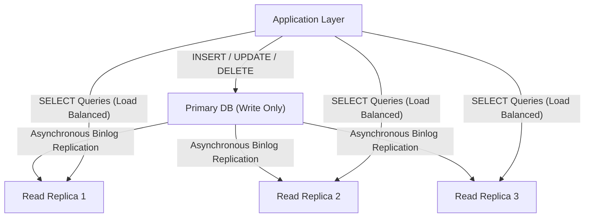
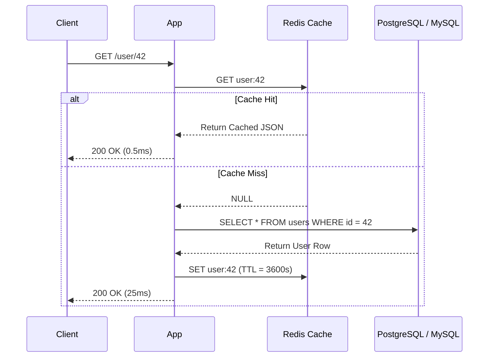

# Module 01: DBMS — Database Scaling, Sharding, and Caching

---

## 1. Vertical vs. Horizontal Scaling

When an enterprise application outgrows its single database server, two primary scaling paths exist:

```
VERTICAL SCALING (Scale-Up):
  [ 4 CPU / 16 GB RAM ] ──(Upgrade)──► [ 64 CPU / 512 GB RAM ]
  • Pros: Simple, zero application code changes, full ACID transactions.
  • Cons: Hard hardware ceiling, exponential cost, single point of failure (SPOF).

HORIZONTAL SCALING (Scale-Out):
  [ Node 1 ] <──► [ Node 2 ] <──► [ Node 3 ] <──► [ Node 4 ]
  • Pros: Near-infinite scaling potential, commodity hardware, fault tolerance.
  • Cons: High architectural complexity, network latency, distributed transactions.
```

---

## 2. Replication & Read/Write Splitting

Most real-world workloads are **read-heavy** (e.g., 80% to 95% reads vs. 5% to 20% writes).



### Replication Lag & Eventual Consistency
- **Asynchronous Replication**: Primary confirms write to client immediately without waiting for replicas. High write throughput, but creates a window of **Replication Lag** where a user reads stale data immediately after writing.
- **Synchronous Replication**: Primary waits for at least one replica to acknowledge write before responding. Eliminates stale reads, but increases write latency and decreases availability if replicas slow down.
- **Read-Your-Own-Writes Pattern**: Route reads from a user who just performed a mutation directly to the Primary for a short time window (e.g., 2 seconds).

---

## 3. Database Partitioning

Dividing a single logical table into smaller, distinct physical storage components on the same server.

| Partitioning Type | Description | Best Used When |
| :--- | :--- | :--- |
| **Range Partitioning** | Rows assigned based on values falling within continuous ranges (e.g., dates: `2024_Q1`, `2024_Q2`). | Time-series, financial transactions, logs. |
| **Hash Partitioning** | Rows assigned via a hash function: `hash(user_id) % num_partitions`. | Evenly distributing random keys to avoid data hotspots. |
| **List Partitioning** | Rows assigned based on explicit enumeration (e.g., `country_code IN ('US', 'CA')`). | Geographic routing or categorical segregation. |
| **Vertical Partitioning** | Splitting columns into separate tables (e.g., basic profile fields vs. large `bio_text` / images). | Minimizing I/O by preventing large, rarely used columns from polluting buffer pools. |

---

## 4. Database Sharding & Consistent Hashing

When data exceeds the storage or I/O capacity of a single physical machine, data is distributed across multiple distinct database instances (**Shards**).

```
          ┌──────────────────────────────────────────────┐
          │               APPLICATION ROUTER             │
          └──────────────────────┬───────────────────────┘
                                 │
           ┌─────────────────────┼─────────────────────┐
           ▼                     ▼                     ▼
┌────────────────────┐ ┌────────────────────┐ ┌────────────────────┐
│      SHARD 1       │ │      SHARD 2       │ │      SHARD 3       │
│ User IDs: 1 - 1M   │ │ User IDs: 1M - 2M  │ │ User IDs: 2M - 3M  │
└────────────────────┘ └────────────────────┘ └────────────────────┘
```

### 4.1 Choosing a Shard Key
The **Shard Key** determines the destination shard for each row:
- **Good Shard Key**: High cardinality, even distribution of writes, aligns with common query access patterns (e.g., `account_id` in SaaS).
- **Bad Shard Key**: Low cardinality (e.g., `country`) or sequential timestamps (causes all write traffic to flood the single latest shard, creating a write hotspot).

### 4.2 The Sharding Challenges
1. **Cross-Shard Joins**: Joining tables across different physical servers requires network calls, distributed sorting, and extreme latency. Solution: Denormalize or co-locate related records using the same shard key.
2. **Distributed Transactions**: Enforcing ACID across shards requires complex protocols like Two-Phase Commit (2PC), which degrades throughput.

---

## 5. In-Memory Caching (Redis / Memcached)

Placing an in-memory key-value store in front of the relational database reduces read latency from milliseconds to microseconds.



### 5.1 Caching Patterns
1. **Cache-Aside (Lazy Loading)**:
   - Application checks cache first. On miss, reads from DB and writes to cache.
   - *Resilient*: If cache fails, DB still works (though under higher load).
2. **Write-Through**:
   - Application writes to cache, and the cache synchronously updates the database.
   - Ensures cache and DB are always consistent.
3. **Write-Back (Write-Behind)**:
   - Application writes only to cache; cache asynchronously batches writes to DB.
   - Extremely high write throughput; risk of data loss if cache node crashes before flushing to disk.

### 5.2 Critical Caching Failure Modes & Solutions
| Problem | Cause | Enterprise Solution |
| :--- | :--- | :--- |
| **Cache Stampede (Thundering Herd)** | A popular key expires, and thousands of concurrent requests simultaneously hit the database to recalculate it. | Use **Distributed Mutex Lock** on the key during recalculation, or implement **Probabilistic Early Expiration (XFetch)**. |
| **Cache Penetration** | Requests for keys that exist neither in cache NOR in the database (e.g., malicious non-existent IDs). | Cache empty values (`NULL`) with a short TTL, or place a **Bloom Filter** before the cache. |
| **Cache Avalanche** | A large percentage of cached keys have the exact same TTL and expire at the same instant. | Add **Random Jitter** to the TTL (e.g., `base_ttl + random(0, 300)` seconds). |
