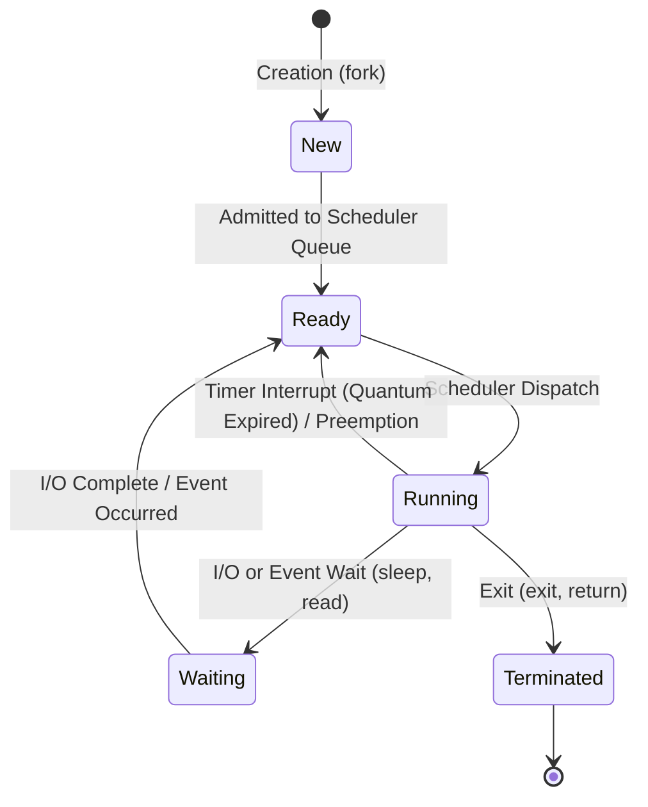

# Module 03: OS — Processes, Threads & CPU Scheduling

---

## 1. Process vs. Thread Architecture

Understanding the boundary between processes and threads is a core topic in OS technical rounds.

```
┌────────────────────────────────────────────────────────────────────────┐
│                          PROCESS ADDRESS SPACE                         │
├────────────────────────────────────────────────────────────────────────┤
│ Text Segment (Compiled Code & Instructions)                            │
├────────────────────────────────────────────────────────────────────────┤
│ Data Segment (Global & Static Variables)                               │
├────────────────────────────────────────────────────────────────────────┤
│ Heap Segment (Dynamically Allocated Objects - Shared across Threads)   │
├───────────────────────────────────┬────────────────────────────────────┤
│ THREAD 1                          │ THREAD 2                           │
│ • Registers & Program Counter (PC)│ • Registers & Program Counter (PC) │
│ • Stack (Local variables, frames) │ • Stack (Local variables, frames)  │
└───────────────────────────────────┴────────────────────────────────────┘
```

### 1.1 Comparison Matrix
| Dimension | Process | Thread (Lightweight Process) |
| :--- | :--- | :--- |
| **Definition** | An executing instance of a computer program. | The smallest unit of execution dispatched by the CPU scheduler. |
| **Memory Space** | Isolated private address space (protected by MMU). | Shares Code, Data, and Heap with peer threads in the process. |
| **Context Switch Overhead** | **High**: Flushes TLB, switches page table pointers in MMU, saves entire PCB. | **Low**: Retains shared page tables; saves only registers, PC, and stack pointer. |
| **Communication** | Requires Inter-Process Communication (IPC): Pipes, Sockets, Shared Memory. | Direct communication via shared memory variables (requires synchronization). |
| **Failure Impact** | Fault in one process does not crash other processes. | An unhandled fatal crash (e.g., segfault) in one thread terminates the entire process. |

---

## 2. Process Lifecycle & State Machine



---

## 3. The Process Control Block (PCB)

The OS kernel maintains a dedicated **PCB** in kernel space for every active process:
1. **PID (Process ID)**: Unique numerical identifier.
2. **Process State**: Current state (Ready, Running, Blocked, etc.).
3. **Program Counter (PC)**: Memory address of the next instruction to execute.
4. **CPU Registers**: Accumulators, index registers, stack pointers.
5. **CPU Scheduling Information**: Process priority, scheduling queue pointers.
6. **Memory Management Information**: Page tables, segment tables.
7. **Accounting & I/O Status**: Open file descriptors (`0, 1, 2...`), allocated hardware devices.

---

## 4. CPU Scheduling Algorithms

The CPU scheduler selects an available process from the ready queue to allocate the CPU.

### 4.1 Scheduling Metrics
- **Turnaround Time**: Time from submission to completion ($T_{\text{completion}} - T_{\text{arrival}}$).
- **Waiting Time**: Total time spent sitting in the ready queue ($T_{\text{turnaround}} - T_{\text{burst}}$).
- **Response Time**: Time from submission to first CPU response.

---

### 4.2 Algorithm Comparisons

| Algorithm | Preemptive? | Pros | Cons & Pitfalls |
| :--- | :--- | :--- | :--- |
| **First-Come, First-Served (FCFS)** | Non-preemptive | Simple, FIFO queue implementation. | **Convoy Effect**: Short processes stuck waiting behind one massive CPU-burst job. |
| **Shortest Job First (SJF)** | Non-preemptive | Mathematically provable **minimum average waiting time**. | Impossible to know burst time in advance; **Starvation** of long jobs. |
| **Shortest Remaining Time First (SRTF)** | **Preemptive** | Preempts if an incoming process has shorter remaining burst time. | High context switch overhead; long jobs can starve indefinitely. |
| **Round Robin (RR)** | **Preemptive** | Fair, excellent response time for interactive systems. | Performance heavily dependent on **Time Quantum ($q$)**. |
| **Priority Scheduling** | Both | Critical high-priority jobs executed immediately. | Low-priority jobs can starve. Solution: **Aging** (gradually increase priority over time). |

### 4.3 The Round Robin Time Quantum ($q$) Trade-off
- **If $q \to \infty$**: Round Robin degenerates into First-Come First-Served (FCFS).
- **If $q \to 0$**: "Processor Sharing" illusion, but CPU spends 90%+ of its cycles on context switching overhead rather than productive work.
- **Rule of Thumb**: Set $q$ such that 80% of CPU bursts are shorter than $q$ (typically 10ms to 50ms).

---

## 5. Multi-Threading & The Python GIL

In multi-threaded Python runtimes, CPU core utilization is governed by the interpreter's internal synchronization constraints:

```
CPython Process
  ┌────────────────────────────────────────────────────────┐
  │       GLOBAL INTERPRETER LOCK (GIL)                    │
  ├────────────────────────────────────────────────────────┤
  │ [Thread 1 (Running)] ──► Holds GIL (Executes Python)   │
  │ [Thread 2 (Waiting)] ──► Blocked waiting for GIL       │
  │ [Thread 3 (Waiting)] ──► Blocked waiting for GIL       │
  └────────────────────────────────────────────────────────┘
```

### 5.1 What is the GIL?
The **Global Interpreter Lock (GIL)** is a mutex used by the CPython interpreter to synchronize thread execution so that only **one native thread executes Python bytecode at a time**.

- **Why does it exist?** CPython's memory management uses reference counting. Without the GIL, concurrent threads mutating reference counts on shared Python objects would trigger race conditions and memory corruption.
- **I/O-bound tasks**: Threads release the GIL when waiting for network requests, disk reads, or database queries. Multi-threading is highly effective here.
- **CPU-bound tasks**: Multi-threading provides **zero speedup** (and can even be slower due to context switching overhead).
- **Solution for CPU-bound parallelism**: Use the `multiprocessing` module (creates separate OS processes with independent GILs and memory spaces) or libraries written in C/Rust (like NumPy) that release the GIL during matrix computations.
