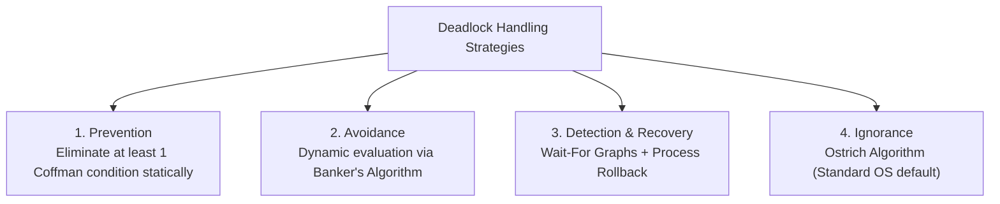

# Module 03: OS — Concurrency, Synchronization & Deadlocks

---

## 1. Race Conditions & The Critical Section Problem

A **Race Condition** occurs when multiple concurrent execution threads access and manipulate shared data concurrently, and the final outcome depends on the non-deterministic order in which instruction execution interleaves.

```
Thread A: counter = counter + 1        Thread B: counter = counter - 1
---------------------------------     ---------------------------------
1. Read counter (e.g., 5)             1. Read counter (e.g., 5)
2. Add 1 (local = 6)                  2. Subtract 1 (local = 4)
3. Write back counter = 6             3. Write back counter = 4 (Overwrites!)
Result: Inconsistent State (4 or 6 instead of expected 5)
```

### The Three Critical Section Requirements
Any valid algorithmic solution to the Critical Section problem must satisfy three criteria:
1. **Mutual Exclusion**: If thread $T_i$ is executing in its critical section, no other threads can execute in their critical sections simultaneously.
2. **Progress**: If no thread is executing in its critical section and some threads wish to enter, only those threads not in their remainder section can participate in deciding who enters next, and selection cannot be postponed indefinitely.
3. **Bounded Waiting**: There must be a bound on the number of times other threads are allowed to enter their critical sections after a thread has requested entry before that request is granted (preventing indefinite starvation).

---

## 2. Synchronization Primitives

```
┌────────────────────────────────────────────────────────────────────────┐
│                      SYNCHRONIZATION PRIMITIVES                        │
└───────────────────────────────────┬────────────────────────────────────┘
                                    │
          ┌─────────────────────────┼─────────────────────────┐
          ▼                         ▼                         ▼
┌───────────────────┐     ┌───────────────────┐     ┌───────────────────┐
│       MUTEX       │     │     SEMAPHORE     │     │     SPINLOCK      │
├───────────────────┤     ├───────────────────┤     ├───────────────────┤
│ • Binary (0 or 1) │     │ • Integer counter │     │ • Busy-waits in a │
│ • Ownership: Only │     │ • No ownership:   │     │   CPU tight loop  │
│   the locking     │     │   Any thread can  │     │ • Ideal for fast, │
│   thread can      │     │   signal / post   │     │   sub-microsecond │
│   unlock it       │     │ • Counting / Bin  │     │   kernel locks    │
└───────────────────┘     └───────────────────┘     └───────────────────┘
```

### 2.1 Mutex vs. Semaphore
| Dimension | Mutex (Mutual Exclusion) | Counting Semaphore |
| :--- | :--- | :--- |
| **Data Type** | Binary state (`LOCKED` / `UNLOCKED`). | Integer counter initialized to resource capacity $K$. |
| **Ownership** | **Strict Ownership**: Only the thread that acquired the lock can release it. | **No Ownership**: Any thread can call `signal()` (`V()`) to wake a waiting thread. |
| **Primary Use** | Serializing access to a single shared resource or critical section. | Managing access to a pool of $K$ identical resources, or signaling events. |
| **Operations** | `lock()` and `unlock()`. | `wait()` (`P()`) decrements counter; blocks if $\le 0$. `signal()` (`V()`) increments counter. |

---

## 3. Classic Synchronization Problems

### 3.1 The Producer-Consumer Problem (Bounded Buffer)
Multiple producers place items into a fixed-capacity buffer of size $N$, and multiple consumers remove items.

```python
import threading
import time

BUFFER_CAPACITY = 5
buffer = []

# Synchronization Primitives
mutex = threading.Lock()
empty_slots = threading.Semaphore(BUFFER_CAPACITY)  # Tracks available space
full_slots = threading.Semaphore(0)                 # Tracks produced items

def producer(producer_id: int):
    item_id = 0
    while True:
        item = f"P{producer_id}-Item{item_id}"
        empty_slots.acquire()  # Decrement empty slot count (blocks if buffer full)
        with mutex:
            buffer.append(item)
            print(f"[Producer {producer_id}] Produced: {item} | Buffer Size: {len(buffer)}")
        full_slots.release()   # Increment item count (signals consumers)
        item_id += 1
        time.sleep(0.5)

def consumer(consumer_id: int):
    while True:
        full_slots.acquire()   # Decrement available item count (blocks if buffer empty)
        with mutex:
            item = buffer.pop(0)
            print(f"  [Consumer {consumer_id}] Consumed: {item} | Buffer Size: {len(buffer)}")
        empty_slots.release()  # Increment empty slot count (signals producers)
        time.sleep(0.8)
```

---

## 4. Deadlocks: Theory & Management

A **Deadlock** occurs when a set of concurrent processes are permanently blocked because each process holds a resource that another process needs, creating a circular wait cycle.

```
Process P1 ──[Holds Resource R1]──► [Requests Resource R2]
    ▲                                        │
    │                                        ▼
[Requests Resource R1] ◄──[Holds Resource R2]── Process P2
```

### 4.1 The Four Coffman Conditions
All four conditions must hold simultaneously for a deadlock to occur:
1. **Mutual Exclusion**: At least one resource is held in a non-shareable mode (only one process at a time).
2. **Hold and Wait**: A process is holding at least one resource and waiting to acquire additional resources held by other processes.
3. **No Preemption**: Resources cannot be forcibly taken from a process; they can only be released voluntarily after completing its task.
4. **Circular Wait**: A closed chain of processes exists: $P_0$ waits for $P_1$, $P_1$ waits for $P_2$, $\dots$, and $P_n$ waits for $P_0$.

---

### 4.2 Deadlock Handling Strategies



#### 1. Deadlock Prevention
- **Eliminate Circular Wait**: Impose a global total ordering on all resources (e.g., $R_1 < R_2 < R_3$). A process can only request a resource if its identifier is strictly higher than all resources it currently holds.

#### 2. Deadlock Avoidance (Banker's Algorithm)
Before granting a resource allocation request, the OS simulates the allocation and verifies whether the system remains in a **Safe State**.
- **Safe State**: A sequence of process completions $\langle P_1, P_2, \dots, P_n \rangle$ exists such that each process can satisfy its maximum remaining resource demands using currently available resources plus resources released by preceding processes.
- **Data Structures**:
  - $\text{Available}[m]$: Available units of each resource type.
  - $\text{Max}[n][m]$: Maximum demand of each process.
  - $\text{Allocation}[n][m]$: Currently allocated resources.
  - $\text{Need}[n][m] = \text{Max}[n][m] - \text{Allocation}[n][m]$.

#### 3. Deadlock Detection & Recovery
- **Wait-For Graph**: A directed graph where nodes are processes, and directed edge $P_i \to P_j$ indicates $P_i$ is waiting for $P_j$ to release a resource. Cycles indicate deadlock.
- **Recovery**:
  - Terminate one or more deadlocked processes (victim selection based on CPU time consumed or priority).
  - Preempt resources and roll back the victim process to a previous checkpoint.
