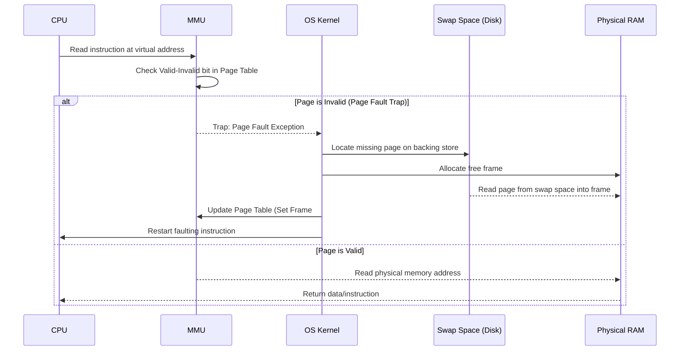

# Module 03: OS — Memory Management & Virtual Memory

---

## 1. Logical vs. Physical Address Space

```
CPU ──(Logical Address: Page # + Offset)──► [ MMU ] ──(Physical Address: Frame # + Offset)──► RAM
```

- **Logical (Virtual) Address**: Generated by the CPU during execution; independent of physical hardware boundaries.
- **Physical Address**: The actual memory cell address loaded onto the bus of the physical RAM hardware.
- **MMU (Memory Management Unit)**: Hardware component translating virtual addresses to physical addresses at runtime.

---

## 2. Memory Fragmentation

| Fragmentation Type | Definition | Occurs In | Mitigation |
| :--- | :--- | :--- | :--- |
| **Internal Fragmentation** | Unused memory allocated inside a fixed-size partition or page frame (e.g., a process requesting 1 KB allocated a full 4 KB page leaves 3 KB wasted). | Paging systems, fixed partitioning. | Smaller page sizes (with trade-off of larger page tables). |
| **External Fragmentation** | Total free memory is sufficient to satisfy an allocation request, but the memory is fragmented into small non-contiguous blocks. | Contiguous memory allocation, segmentation. | **Paging** (non-contiguous allocation), Compaction. |

---

## 3. Paging Architecture & Translation Lookaside Buffer (TLB)

Paging breaks physical memory into fixed-sized blocks called **Frames** and logical memory into blocks of the same size called **Pages**.

```
Logical Address: [ Page Number (p) | Offset (d) ]
                         │
         ┌───────────────┴───────────────┐
         ▼ (Lookup in Hardware Cache)     ▼ (Lookup in Memory Page Table on Miss)
┌───────────────────┐           ┌───────────────────┐
│     TLB CACHE     │ ──Miss──► │    PAGE TABLE     │
│  Page p -> Frame f│           │  Page p -> Frame f│
└─────────┬─────────┘           └─────────┬─────────┘
          │                               │
          └───────────────┬───────────────┘
                          ▼
Physical Address: [ Frame Number (f) | Offset (d) ]
```

### 3.1 Translation Lookaside Buffer (TLB)
The TLB is a high-speed associative hardware cache holding recent virtual-to-physical address translations.

### 3.2 Effective Memory Access Time (EMAT) Formula
Let:
- $\alpha = \text{TLB Hit Ratio}$ (e.g., $95\% = 0.95$)
- $t_{\text{TLB}} = \text{TLB access latency}$ (e.g., $2\text{ ns}$)
- $t_{\text{RAM}} = \text{Main memory access latency}$ (e.g., $100\text{ ns}$)

$$\text{EMAT} = \alpha \times (t_{\text{TLB}} + t_{\text{RAM}}) + (1 - \alpha) \times (t_{\text{TLB}} + 2 \times t_{\text{RAM}})$$

*Example calculation*:
$$\text{EMAT} = 0.95 \times (2 + 100) + 0.05 \times (2 + 200) = 0.95 \times 102 + 0.05 \times 202 = 96.9 + 10.1 = 107\text{ ns}$$

---

## 4. Demand Paging & Page Fault Handling

Demand paging brings a page into physical memory only when it is accessed during execution.



---

## 5. Page Replacement Algorithms

When a page fault occurs and all physical RAM frames are occupied, the OS must select an existing frame to evict.

### 5.1 First-In, First-Out (FIFO) & Belady's Anomaly
- **Algorithm**: Evicts the page that has been in memory the longest.
- **Belady's Anomaly**: For certain page-reference strings, **increasing the number of allocated physical frames results in an INCREASE in page faults** (violates the intuitive assumption that more memory always yields fewer faults).

### 5.2 Optimal Page Replacement (OPT / Clairvoyant)
- **Algorithm**: Evict the page that will not be used for the longest period of time in the future.
- **Role**: Impossible to implement in general operating systems (requires future knowledge of program execution); serves as the theoretical benchmark for evaluating real algorithms.

### 5.3 Least Recently Used (LRU)
- **Algorithm**: Evicts the page that has not been accessed for the longest period of time (approximates OPT using the recent past as a proxy for the future).
- **Implementation**: Managed via a timestamp counter or a Doubly Linked List stack.

### 5.4 Clock Algorithm (Second-Chance)
- **Algorithm**: Circular queue of frames with a hardware Reference Bit ($0$ or $1$).
- **Inspection**:
  - If reference bit is $0$, evict this frame.
  - If reference bit is $1$, clear bit to $0$, advance the clock hand, and inspect next frame.

---

## 6. Thrashing & The Working Set Model

### 6.1 Definition
**Thrashing** occurs when a system spends more CPU cycles swapping pages in and out of backing store than executing productive instructions.
- **Cause**: The sum of localities (active working sets) across all running processes exceeds total physical RAM capacity ($\sum \text{WSS}_i > \text{Total RAM}$).
- **Result**: CPU utilization drops sharply toward zero as all processes block waiting for swap disk I/O.

```
CPU
Util %
 100 │         /═══════\
     │        /         \
     │       /           \
     │      /             \  <--- Thrashing Boundary
     │     /               \
   0 └────/─────────────────\────────► Degree of Multiprogramming (# Processes)
```

### 6.2 Working Set Model
- **Working Set Window ($\Delta$)**: A fixed parameter representing a window of page references.
- **Working Set Size ($\text{WSS}_i$)**: The set of distinct pages referenced by process $P_i$ in the most recent $\Delta$ references.
- **Resolution**: If $\sum \text{WSS}_i > \text{Total RAM}$, the OS suspends (swaps out) one entire process, freeing its frames to prevent thrashing.
