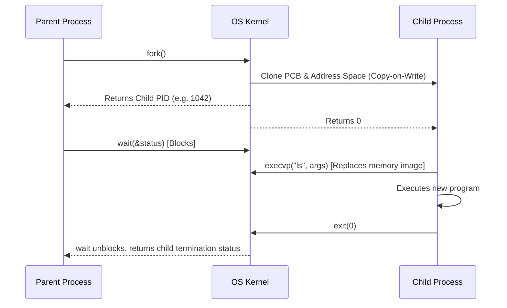

# Module 03: OS — IPC, System Calls & Linux Internals

---

## 1. Inter-Process Communication (IPC) Taxonomy

Because processes have independent, isolated virtual address spaces, data exchange requires explicit IPC mechanisms managed by the kernel.

```
┌────────────────────────────────────────────────────────────────────────┐
│                        IPC MECHANISMS IN OS                            │
└───────────────────────────────────┬────────────────────────────────────┘
                                    │
    ┌─────────────────┬─────────────┴─────┬─────────────────┬────────────┐
    ▼                 ▼                   ▼                 ▼            ▼
┌─────────┐     ┌───────────┐     ┌──────────────┐     ┌──────────┐ ┌─────────┐
│  PIPES  │     │   FIFOS   │     │SHARED MEMORY │     │ MESSAGE  │ │ SOCKETS │
│ (Anon)  │     │  (Named)  │     │(Fastest IPC) │     │  QUEUES  │ │(Network)│
└─────────┘     └───────────┘     └──────────────┘     └──────────┘ └─────────┘
```

### Detailed IPC Mechanisms Comparison
| IPC Method | Scope | Direction | Speed | Synchronization Required? |
| :--- | :--- | :--- | :--- | :--- |
| **Anonymous Pipe** | Related processes (Parent-Child) | Half-Duplex (Unidirectional) | Medium (Kernel buffer copying) | Managed automatically by kernel buffer limits. |
| **Named Pipe (FIFO)** | Unrelated processes on same host | Bidirectional (Typically Half-Duplex) | Medium (Kernel buffer) | File-system blocking on read/write. |
| **Shared Memory** | Any process with segment access | Full-Duplex | **Fastest** (Zero kernel copying; direct RAM access) | **Mandatory** (Requires Mutex or Semaphore). |
| **Message Queue** | Unrelated processes | Full-Duplex | Medium (Kernel message framing) | Handled by OS queue primitives. |
| **Unix Domain Socket** | Processes on same host | Full-Duplex | Fast (Bypasses network protocol stack) | OS socket buffer mechanisms. |

---

## 2. Process Lifecycle System Calls: `fork()`, `exec()`, `wait()`



### 2.1 Copy-on-Write (COW) Optimization
Historically, `fork()` duplicated the parent's entire physical address space into new memory frames, creating massive overhead. 
Modern operating systems use **Copy-on-Write**:
1. Parent and child initially share the exact same physical memory frames with **read-only permissions**.
2. If either process attempts a write modification, a memory protection fault triggers. The kernel duplicates *only that specific 4 KB page frame*, preserving performance and memory.

---

## 3. Zombie vs. Orphan Processes

```
                     ┌────────────────────────────────┐
                     │     PROCESS ANOMALIES          │
                     └───────────────┬────────────────┘
                                     │
           ┌─────────────────────────┴─────────────────────────┐
           ▼                                                   ▼
┌─────────────────────────────────┐         ┌─────────────────────────────────┐
│        ZOMBIE PROCESS           │         │         ORPHAN PROCESS          │
├─────────────────────────────────┤         ├─────────────────────────────────┤
│ • Execution terminated (exit)   │         │ • Parent process terminated     │
│ • Parent has NOT called wait()  │         │   while child is STILL running  │
│ • Retains entry in Process Table│         │ • Re-parented to init / systemd │
│   (Consumes PID table slots)    │         │   (PID 1)                       │
│ • State: 'Z' in ps              │         │ • Automatically reaped on exit  │
└─────────────────────────────────┘         └─────────────────────────────────┘
```

---

## 4. Linux File Descriptors & Standard Streams

Every Linux process initializes with three standard file descriptors (FDs) open in its file table:
- `0`: Standard Input (`stdin`)
- `1`: Standard Output (`stdout`)
- `2`: Standard Error (`stderr`)

### Redirection Operators:
- `cmd > file.txt`: Redirects `stdout` to file (overwrites).
- `cmd >> file.txt`: Appends `stdout` to file.
- `cmd 2> error.log`: Redirects only `stderr` to file.
- `cmd > out.log 2>&1`: Merges `stderr` into `stdout`.
- `cmd1 | cmd2`: Connects `stdout` of `cmd1` to `stdin` of `cmd2` via an anonymous pipe.

---

## 5. Core Linux CLI Diagnostics Reference

### 5.1 Process & Resource Monitoring
```bash
# View all processes with CPU & RAM consumption
ps aux | grep python

# Real-time resource utilization
top
htop

# Terminate processes
kill -15 <PID>   # SIGTERM (Graceful termination)
kill -9 <PID>    # SIGKILL (Forced kernel termination)
```

### 5.2 Network & Socket Inspection
```bash
# Display listening TCP/UDP ports and associated PIDs
ss -tulnp
netstat -tulnp

# Identify process occupying a specific port
lsof -i :8080
```

### 5.3 Text Processing & File Searching
```bash
# Search recursively for regex pattern
grep -rn "TODO" /path/to/code

# Print specific column from delimiter-separated output
awk -F':' '{print $1}' /etc/passwd

# Find files modified in the last 24 hours
find /var/log -type f -mtime -1

# Batch execution over searched files
find . -name "*.log" | xargs rm -f
```

### 5.4 File Permissions & Octal Calculation
Permissions: `Read (4)`, `Write (2)`, `Execute (1)`.
- `chmod 755 script.sh`: Owner (`7 = 4+2+1`), Group (`5 = 4+1`), Others (`5 = 4+1`).
- `chmod 600 id_rsa`: Owner read/write (`6 = 4+2`), Group/Others no permissions (`0`).
