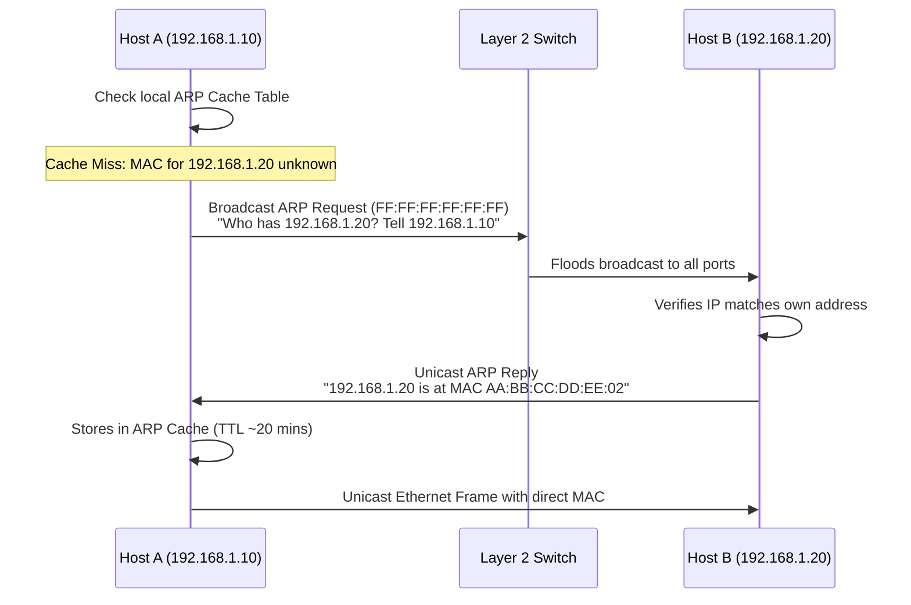

# Module 04: Networking — OSI vs. TCP/IP & Network Layers

---

## 1. The 7-Layer OSI Model vs. 4-Layer TCP/IP Model

The Open Systems Interconnection (OSI) reference model establishes a conceptual framework for network protocols, while the TCP/IP stack represents the practical architecture of the global internet.

```
OSI 7-LAYER MODEL                       TCP/IP 4-LAYER MODEL
┌────────────────────────────────┐     ┌────────────────────────────────┐
│ 7. Application  (HTTP, DNS)    │ ──┐ │                                │
│ 6. Presentation (TLS, JSON)    │ ──┼─► 1. Application Layer           │
│ 5. Session      (RPC, Sockets) │ ──┘ │                                │
├────────────────────────────────┤     ├────────────────────────────────┤
│ 4. Transport    (TCP, UDP)     │ ────► 2. Transport Layer             │
├────────────────────────────────┤     ├────────────────────────────────┤
│ 3. Network      (IP, ICMP)     │ ────► 3. Internet Layer              │
├────────────────────────────────┤     ├────────────────────────────────┤
│ 2. Data Link    (Ethernet, MAC)│ ──┐ │                                │
│ 1. Physical     (Cables, Bits) │ ──┼─► 4. Network Access / Link Layer │
└────────────────────────────────┘   └──┘                               │
                                       └────────────────────────────────┘
```

### Layer-by-Layer Technical Specification
| Layer | Protocol Data Unit (PDU) | Primary Addressing | Key Protocols | Hardware / Devices |
| :--- | :--- | :--- | :--- | :--- |
| **7. Application** | Data / Message | Process / Port | HTTP, HTTPS, DNS, SSH, SMTP | Gateways, Load Balancers |
| **6. Presentation**| Data | Syntax / Format | SSL/TLS, JSON, XML, JPEG | Application Runtimes |
| **5. Session**     | Data | Connection ID | Sockets, NetBIOS, RPC | Operating System Kernels |
| **4. Transport**   | **Segment** (TCP) / **Datagram** (UDP) | Port Numbers (`0 - 65535`) | TCP, UDP, SCTP | L4 Load Balancers, Firewalls |
| **3. Network**     | **Packet** | Logical IP (`IPv4`, `IPv6`) | IP, ICMP, ARP, OSPF, BGP | **Routers**, L3 Switches |
| **2. Data Link**   | **Frame** | Physical MAC Address (48-bit) | Ethernet (802.3), Wi-Fi (802.11) | **Switches**, Bridges, NICs |
| **1. Physical**    | **Bits** | Voltages, light pulses, RF | 1000BASE-T, Fiber, Coaxial | Hubs, Repeaters, Cables |

---

## 2. Data Encapsulation & Decapsulation

When sending data across a network, each layer appends its own protocol header (and sometimes trailer) before delegating to the lower layer:

```
[ Application Data ]
        │
        ▼ (Layer 4 adds TCP Header: Source/Dest Ports, Seq/Ack Numbers)
[ TCP Header | Application Data ]  ===> (Segment)
        │
        ▼ (Layer 3 adds IP Header: Source/Dest IP Addresses, TTL)
[ IP Header | TCP Header | Application Data ]  ===> (Packet)
        │
        ▼ (Layer 2 adds Ethernet Header: Source/Dest MAC Addresses & FCS Trailer)
[ Ethernet Header | IP Header | TCP Header | Application Data | Frame Check Sequence ] ===> (Frame)
        │
        ▼ (Layer 1 converts frame into physical binary signaling)
0 1 1 0 1 0 0 1 1 0 1 1 0 1 0 ... ===> (Bits on Wire/Air)
```

- **Encapsulation (Sender)**: Top-down processing wrapping payload in headers.
- **Decapsulation (Receiver)**: Bottom-up processing validating and stripping headers.

---

## 3. Network Devices & Collision / Broadcast Domains

| Device | Operating Layer | Collision Domain | Broadcast Domain | Forwarding Logic |
| :--- | :--- | :--- | :--- | :--- |
| **Hub** | Layer 1 (Physical) | **Single shared domain** (All connected ports collide) | **Single shared domain** | Electrical repeater; repeats every incoming bit to all connected ports indiscriminately. |
| **Switch** | Layer 2 (Data Link) | **Separates collision domains** (Each port is an isolated collision domain) | **Single shared domain** | Inspects destination MAC address; forwards via an internal in-memory **MAC Address Table (CAM Table)**. |
| **Router** | Layer 3 (Network) | **Separates collision domains** | **Separates broadcast domains** (Does not forward layer 2 broadcasts) | Inspects destination IP address; routes packets across subnets via **Routing Tables**. |

---

## 4. Address Resolution Protocol (ARP)

### 4.1 Purpose
Routers and hosts route packets across the internet using Layer 3 IP addresses. However, delivery across a local Ethernet link requires the Layer 2 physical hardware MAC address. **ARP resolves a known IP address to its corresponding physical MAC address.**

### 4.2 ARP Resolution Lifecycle

