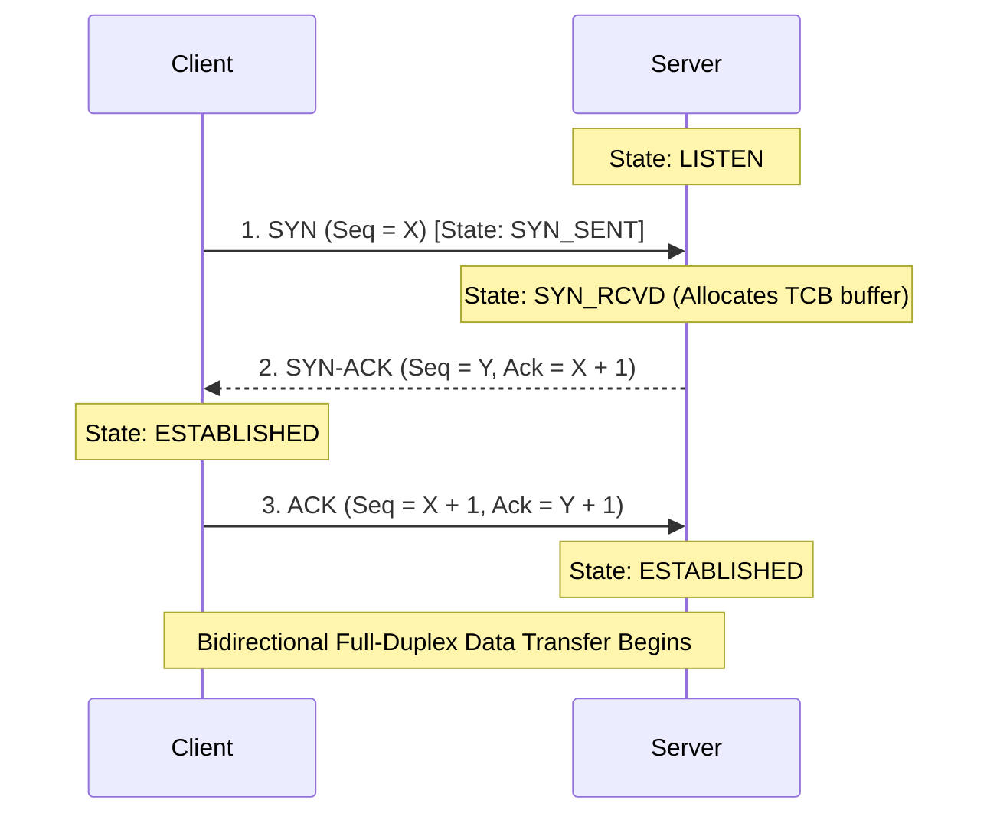
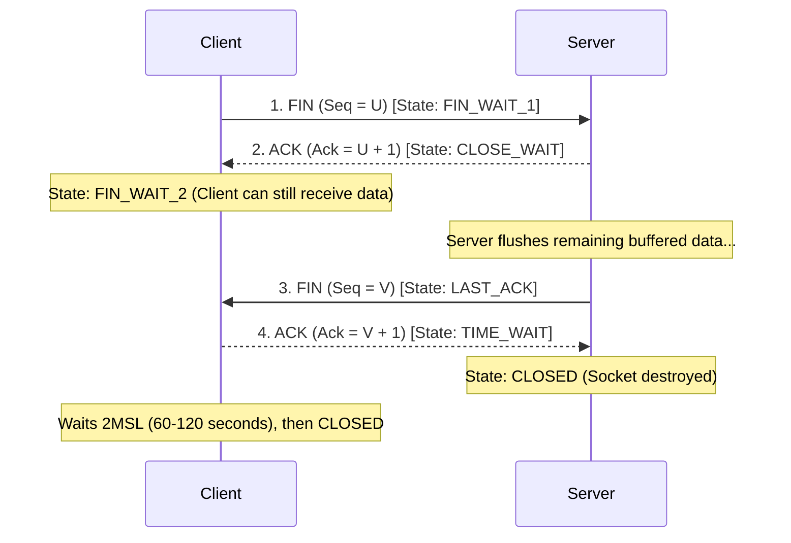

# Module 04: Networking — TCP vs. UDP & Transport Layer Internals

---

## 1. TCP vs. UDP Comprehensive Comparison

Transport layer protocols manage end-to-end communication services between applications running on different network hosts.

```
┌────────────────────────────────────────────────────────────────────────┐
│                        TRANSPORT PROTOCOLS                             │
└───────────────────────────────────┬────────────────────────────────────┘
                                    │
          ┌─────────────────────────┴─────────────────────────┐
          ▼                                                   ▼
┌───────────────────────────────────┐       ┌───────────────────────────────────┐
│ TRANSMISSION CONTROL PROTOCOL(TCP)│       │   USER DATAGRAM PROTOCOL (UDP)    │
├───────────────────────────────────┤       ├───────────────────────────────────┤
│ • Connection-oriented (Handshake) │       │ • Connectionless (Send & Forget)  │
│ • Guaranteed delivery & ordering  │       │ • Unreliable; No ordering or acks │
│ • Flow & Congestion control       │       │ • Zero congestion control         │
│ • Heavyweight header: 20-60 bytes │       │ • Lightweight header: 8 bytes     │
│ • Best for: Web (HTTP), Email, DB │       │ • Best for: DNS, VoIP, Streaming  │
└───────────────────────────────────┘       └───────────────────────────────────┘
```

### Detailed Protocol Feature Matrix
| Dimension | TCP (RFC 793) | UDP (RFC 768) |
| :--- | :--- | :--- |
| **Connection Setup** | Requires 3-Way Handshake before data transmission. | Zero connection setup; packets sent immediately. |
| **Data Ordering** | Guaranteed sequence via 32-bit Sequence Numbers. | No ordering guarantees (packets can arrive out of order). |
| **Reliability** | Retransmits dropped packets via ACKs and timeouts. | Best-effort; dropped packets are discarded permanently. |
| **Flow Control** | Dynamic windowing based on receiver buffer capacity (`rwnd`). | None. Receiver buffer overflow drops incoming packets. |
| **Congestion Control** | Backs off transmission upon detecting network saturation (`cwnd`). | None. Streams continuously at the application's output rate. |
| **Header Overhead** | **20 to 60 Bytes** (Source/Dest Port, Seq, Ack, Flags, Window). | **Fixed 8 Bytes** (Source Port, Dest Port, Length, Checksum). |

---

## 2. The TCP 3-Way Handshake (Connection Establishment)



### Security Alert: SYN Flood Attack & SYN Cookies
- **Vulnerability**: An attacker sends thousands of `SYN` packets from spoofed IP addresses and never replies to the `SYN-ACK`. The server allocates a Transmission Control Block (TCB) in memory for each half-open connection until memory is exhausted (Denial of Service).
- **Defense (SYN Cookies)**: The server does not allocate memory on receiving `SYN`. Instead, it encodes client IP, port, and a cryptographic timestamp into the initial sequence number $Y$. When the client returns the final `ACK`, the server validates the hash and instantiates the connection only then.

---

## 3. TCP 4-Way Handshake (Connection Teardown)

Because TCP connections are full-duplex, each direction of data transfer must be terminated independently.



### Why Does the `TIME_WAIT` State Exist?
The terminating client lingers in `TIME_WAIT` for **2MSL (Maximum Segment Lifetime)** (~60 to 120 seconds) for two reasons:
1. **Ensuring final ACK delivery**: If the final `ACK` is lost in transit, the server retransmits its `FIN`. If the client closed immediately, it would respond with an `RST` error instead of cleanly terminating the server.
2. **Preventing old duplicate packets from colliding with new connections**: Any lingering delayed segments from this connection die on the network before a new socket can reuse the identical IP/port tuple.

---

## 4. Flow Control vs. Congestion Control

| Mechanism | Purpose | Governed By |
| :--- | :--- | :--- |
| **Flow Control** | Prevents the **sender from overwhelming the receiver's** buffer memory. | **Receive Window (`rwnd`)** advertised in the TCP header by the receiver. |
| **Congestion Control**| Prevents the **sender from overwhelming the intermediate network** routers. | **Congestion Window (`cwnd`)** calculated dynamically by the sender. |

The sender's effective transmission limit is:
$$\text{Max Send Window} = \min(\text{rwnd}, \text{cwnd})$$

---

## 5. TCP Congestion Control Algorithms (Tahoe / Reno)

```
Congestion
Window (cwnd)
     ▲
     │                                 Timeout Drops cwnd to 1
     │                       /══════\            │
     │                      / (CA)   \           │
     │            /════════/          \          ▼
ssthresh ─────── / (Slow               \══════► [cwnd = 1]
     │          /   Start)
     │         /
     │   /════/
     └──/────────────────────────────────────────► Transmission Rounds (RTT)
```

1. **Slow Start**:
   - Begins at $\text{cwnd} = 1\text{ MSS}$ (Maximum Segment Size).
   - Doubles exponentially every Round Trip Time (RTT): $1 \to 2 \to 4 \to 8 \dots$
   - Continues until reaching the Slow Start Threshold (`ssthresh`).
2. **Congestion Avoidance (Additive Increase)**:
   - Once $\text{cwnd} \ge \text{ssthresh}$, growth switches to linear: $\text{cwnd} = \text{cwnd} + 1\text{ MSS}$ per RTT.
3. **Congestion Detection & Recovery**:
   - **Timeout (Severe Congestion)**: `ssthresh` is cut in half ($\text{ssthresh} = \text{cwnd} / 2$), and $\text{cwnd}$ resets to $1\text{ MSS}$ (Slow Start restarts).
   - **3 Duplicate ACKs (Mild Congestion / Fast Retransmit)**: Sender detects a single lost packet while subsequent packets arrived. Retransmits the missing packet immediately without waiting for timeout, cuts `cwnd` in half, and enters **Fast Recovery**.
