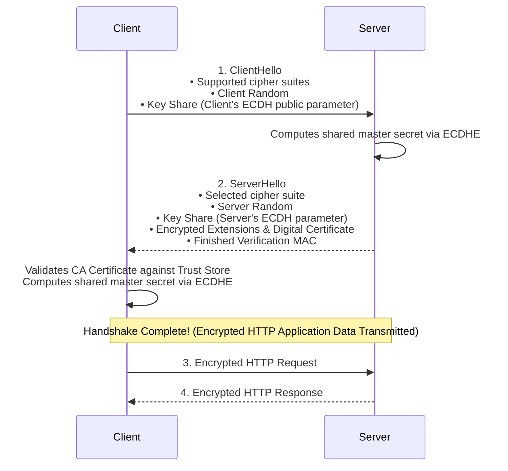
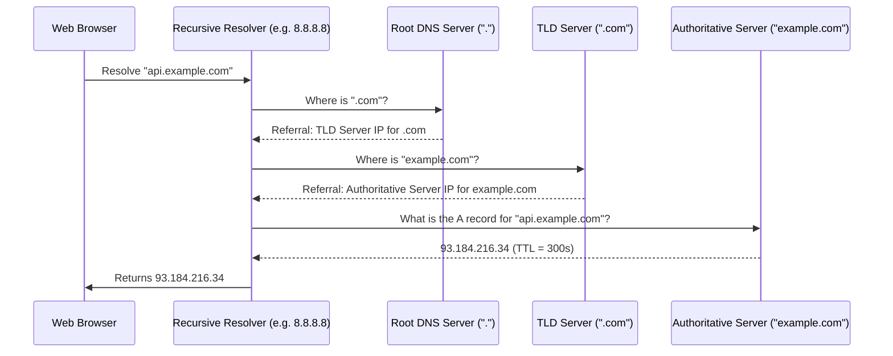

# Module 04: Networking — HTTP, HTTPS & DNS Architecture

---

## 1. Evolution of the HTTP Protocol

```
HTTP/1.1                                HTTP/2                                  HTTP/3 (QUIC)
┌───────────────────────────────┐       ┌───────────────────────────────┐       ┌───────────────────────────────┐
│ • ASCII Text Protocol         │       │ • Binary Framing Layer        │       │ • Built over UDP (QUIC)       │
│ • Persistent TCP Keep-Alive   │       │ • Multiplexing (Single TCP)   │       │ • Zero Head-of-Line Blocking  │
│ • Head-of-Line (HoL) Blocking │       │ • HPACK Header Compression    │       │ • 0-RTT Connection Setup      │
└───────────────────────────────┘       └───────────────────────────────┘       └───────────────────────────────┘
```

### 1.1 Detailed Protocol Evolution Comparison
| Feature | HTTP/1.1 | HTTP/2 | HTTP/3 |
| :--- | :--- | :--- | :--- |
| **Transport Layer** | TCP | TCP | **QUIC (over UDP)** |
| **Format** | Plaintext ASCII | Binary Frames | Binary Frames |
| **Multiplexing** | No (Sequential requests or multiple TCP sockets) | **Yes** (Multiple streams concurrent on 1 TCP socket) | **Yes** (Independent streams over QUIC) |
| **Head-of-Line (HoL) Blocking** | Severe at application layer | Resolved at HTTP layer; persists at TCP layer on packet loss | **Completely eliminated** (single packet loss only delays that stream) |
| **Header Compression** | None (Redundant headers sent per request) | HPACK (Indexed table compression) | QPACK |
| **Connection Migration** | Fails on IP change (requires re-handshake) | Fails on IP change | Supported (Connection ID persists across Wi-Fi $\leftrightarrow$ 4G) |

---

## 2. HTTPS & The SSL/TLS Handshake

HTTPS encrypts HTTP traffic by wrapping it in **Transport Layer Security (TLS)**.

### 2.1 Cryptographic Foundations
- **Asymmetric Encryption (Public/Private Key)**: Computationally heavy; used exclusively during the initial handshake to authenticate server identity and securely agree upon a shared session key (using Elliptic Curve Diffie-Hellman Ephemeral - ECDHE).
- **Symmetric Encryption (Shared Key)**: Extremely fast hardware-accelerated encryption (e.g., AES-256-GCM); encrypts all subsequent application data.
- **Digital Certificates & PKI**: Digital certificates signed by trusted Certificate Authorities (CAs) bind a domain name to a verified public key.

---

### 2.2 TLS 1.3 Handshake (1-RTT Setup)

TLS 1.3 reduced handshake latency from two network round-trips (in TLS 1.2) to **one single round-trip (1-RTT)**:



---

## 3. Domain Name System (DNS) Architecture

DNS translates human-readable domain names (e.g., `api.example.com`) into routable IP addresses (e.g., `93.184.216.34`).

### 3.1 The Hierarchical DNS Tree
```
                         [ Root DNS Servers "." ]
                                     │
           ┌─────────────────────────┼─────────────────────────┐
           ▼                         ▼                         ▼
     [ ".com" TLD ]            [ ".org" TLD ]            [ ".io" TLD ]
           │
           ▼
[ Authoritative Server: "example.com" ]
```

### 3.2 Recursive Resolution Step-by-Step


### 3.3 Core DNS Record Types
| Record Type | Target Format | Purpose |
| :--- | :--- | :--- |
| **A** | 32-bit IPv4 Address | Maps hostname to IPv4 (e.g., `192.0.2.1`). |
| **AAAA** | 128-bit IPv6 Address | Maps hostname to IPv6 (e.g., `2001:db8::1`). |
| **CNAME** | Fully Qualified Domain Name | Canonical alias redirecting one domain name to another. |
| **MX** | Mail Server Hostname + Priority | Directs email to responsible mail exchange servers. |
| **TXT** | Arbitrary Text String | Domain ownership verification, SPF, DKIM, and DMARC security. |
| **NS** | Nameserver Hostname | Delegates a DNS zone to authoritative servers. |
