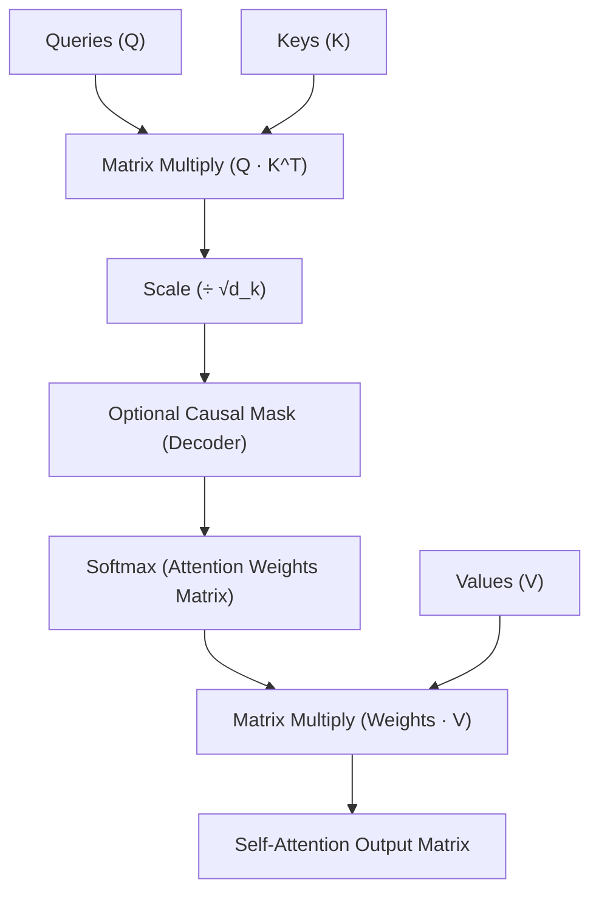

# Module 05: GenAI & ML — Deep Learning & Transformer Architecture

---

## 1. Limitations of Recurrent Networks (RNNs & LSTMs)

Prior to Transformers (Vaswani et al., 2017), sequence-to-sequence modeling relied on recurrent architectures (RNNs, GRUs, LSTMs):

```
RNN Sequential Processing:
x_1 ──► [ Cell ] ──h_1──► [ Cell ] ──h_2──► [ Cell ] ──h_3──► Context Vector
           ▲                 ▲                 ▲
          x_1               x_2               x_3
```

### The Two Fundamental Bottlenecks of RNNs:
1. **No Parallelization (GPU Inefficiency)**:
   Because hidden state $h_t = f(h_{t-1}, x_t)$ depends strictly on the output of step $t-1$, computation must proceed sequentially step-by-step. Training cannot be parallelized across GPU tensor cores.
2. **Information Compression & Vanishing Gradients**:
   Compressing an entire paragraph or book into a single fixed-length hidden vector causes catastrophic forgetting of early tokens over long context windows.

---

## 2. Scaled Dot-Product Self-Attention

Transformers discard recurrence entirely, computing direct token-to-token interactions in parallel via **Self-Attention**.

$$\text{Attention}(Q, K, V) = \text{softmax}\left(\frac{QK^T}{\sqrt{d_k}}\right)V$$



### 2.1 The Mathematical Intuition of $Q, K, V$:
- **Query ($Q = X \cdot W_Q$)**: What this token is looking for.
- **Key ($K = X \cdot W_K$)**: What this token contains / offers.
- **Value ($V = X \cdot W_V$)**: The actual semantic information payload extracted.
- **Dot Product ($Q \cdot K^T$)**: Computes similarity scores between all token pairs ($N \times N$ matrix).

### 2.2 Why Scale by $\frac{1}{\sqrt{d_k}}$?
For large projection dimensions $d_k$, the dot product $\sum_{i=1}^{d_k} q_i k_i$ grows in magnitude with variance $\text{Var} = d_k$. Large values push the **softmax function into regions with extremely small gradients** (saturation), causing vanishing gradients during backpropagation. Dividing by $\sqrt{d_k}$ normalizes the variance back to $1$.

---

## 3. Multi-Head Attention (MHA)

Rather than computing attention once across the full dimension $d_{\text{model}}$, Multi-Head Attention linearly projects $Q, K, V$ into $h$ independent subspaces of dimension $d_k = d_{\text{model}} / h$:

$$\text{MultiHead}(Q, K, V) = \text{Concat}(\text{head}_1, \text{head}_2, \dots, \text{head}_h)W^O$$

$$\text{where } \text{head}_i = \text{Attention}(Q W_i^Q, K W_i^K, V W_i^V)$$

```
                                    ┌──────────────────────┐
                                    │ Multi-Head Output    │
                                    └──────────▲───────────┘
                                               │ Linear Projection W^O
                                    ┌──────────┴───────────┐
                                    │ Concat(H_1, ..., H_h)│
                                    └──────────▲───────────┘
               ┌───────────────────────────────┼───────────────────────────────┐
               │                               │                               │
     ┌──────────────────┐            ┌──────────────────┐            ┌──────────────────┐
     │  Head 1 (Q1,K1,V1)│           │  Head 2 (Q2,K2,V2)│           │  Head h (Qh,Kh,Vh)│
     └────────▲─────────┘            └────────▲─────────┘            └────────▲─────────┘
              │ W_1^Q,K,V                     │ W_2^Q,K,V                     │ W_h^Q,K,V
              └───────────────────────────────┼───────────────────────────────┘
                                              │
                                    [ Input Embeddings X ]
```

- **Benefit**: Allows the model to simultaneously attend to different aspects of relationships (e.g., Head 1 tracks grammatical subject-verb agreement; Head 2 tracks pronoun coreference; Head 3 tracks positional adjacency).

---

## 4. Positional Encodings

Because self-attention operates via permutation-invariant matrix operations, **a Transformer has no inherent sense of token order**. Passing `"dog bites man"` produces the exact same attention outputs as `"man bites dog"` unless positional metadata is injected.

### 4.1 Sinusoidal Positional Encoding
Original Transformer formula using frequencies of sines and cosines:

$$PE_{(pos, 2i)} = \sin\left(\frac{pos}{10000^{2i / d_{\text{model}}}}\right) \qquad PE_{(pos, 2i+1)} = \cos\left(\frac{pos}{10000^{2i / d_{\text{model}}}}\right)$$

### 4.2 Modern RoPE (Rotary Position Embedding)
Used in modern LLMs (LLaMA, Mistral). Instead of adding static vectors to embeddings, RoPE rotates the Query and Key vectors in the complex 2D plane:
$$\langle R_{\Theta, m} q, R_{\Theta, n} k \rangle = g(q, k, m - n)$$
This guarantees that dot products depend strictly on the **relative distance ($m - n$)** between tokens rather than absolute index positions.

---

## 5. Architectural Paradigms: Encoder vs. Decoder

| Architecture | Attention Masking | Representative Models | Primary Strengths |
| :--- | :--- | :--- | :--- |
| **Encoder-Only** | Bidirectional (Attends to all tokens in sequence) | **BERT**, RoBERTa | Classification, sentiment analysis, NER, semantic search. |
| **Decoder-Only** | **Causal Masking** (Can only attend to preceding tokens: $j \le i$) | **GPT-4**, LLaMA, Claude, Gemini | **Autoregressive text generation**, in-context reasoning. |
| **Encoder-Decoder** | Bidirectional in Encoder, Causal in Decoder with Cross-Attention | **T5**, BART | Machine translation, document summarization. |
