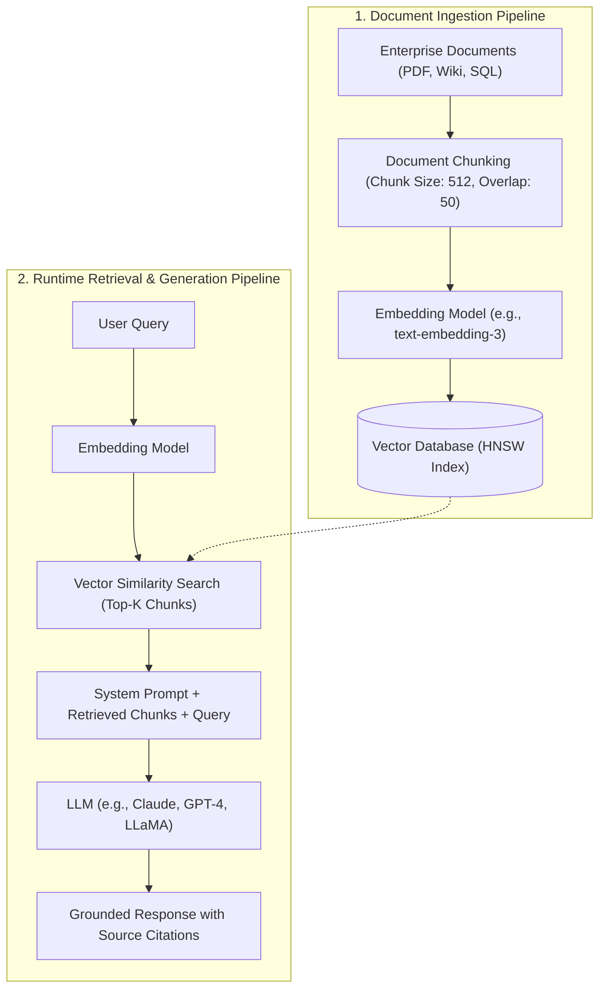

# Module 05: GenAI & ML — RAG, Vector Databases & Enterprise Search

---

## 1. Retrieval-Augmented Generation (RAG) Architecture

Large Language Models suffer from two fundamental enterprise limitations:
1. **Static Knowledge Cutoff**: Models cannot access information created after their training window.
2. **Hallucination on Proprietary Data**: Models invent plausible-sounding but inaccurate answers when queried on internal company documents.

**RAG** connects the parametric memory of an LLM with external non-parametric retrieval systems.



---

## 2. Vector Embeddings & Similarity Metrics

An **Embedding** is a dense numerical vector (typically $384$ to $3072$ dimensions) mapping semantic concepts into geometric vector space, where semantically related terms cluster closely together.

```
Vector Dimensions: [ d_1,  d_2,  d_3, ... d_1536 ]
"King"      ===>   [ 0.82, -0.41, 0.12, ... 0.05 ]
"Queen"     ===>   [ 0.80, -0.38, 0.15, ... 0.07 ] (High Cosine Similarity)
"Pineapple" ===>   [-0.12,  0.89, -0.65,... -0.33 ] (Low Cosine Similarity)
```

### 2.1 Vector Distance Metrics
| Metric | Mathematical Formula | Key Property |
| :--- | :--- | :--- |
| **Cosine Similarity** | $\cos(\theta) = \frac{\mathbf{u} \cdot \mathbf{v}}{\|\mathbf{u}\| \|\mathbf{v}\|}$ | Evaluates only the **angular direction** between vectors, completely ignoring magnitude. Bounds: $[-1, 1]$. |
| **Dot Product** | $\mathbf{u} \cdot \mathbf{v} = \sum_{i=1}^d u_i v_i$ | Sensitive to both angle and vector magnitude. If vectors are normalized to unit length ($\|\mathbf{u}\| = 1$), Dot Product equals Cosine Similarity. |
| **Euclidean Distance ($L_2$)** | $\|\mathbf{u} - \mathbf{v}\|_2 = \sqrt{\sum_{i=1}^d (u_i - v_i)^2}$ | Geometric Euclidean distance between two points in $d$-dimensional space. |

---

## 3. Vector Indexing: Approximate Nearest Neighbors (ANN)

Performing an exact $k$-Nearest Neighbors ($k$-NN) brute-force scan requires comparing the query vector against every single stored vector ($O(N \cdot d)$), which takes seconds to minutes for millions of records. Vector databases use **ANN algorithms** to achieve sub-millisecond retrieval.

```
┌────────────────────────────────────────────────────────────────────────┐
│                          ANN INDEXING ALGORITHMS                       │
└───────────────────────────────────┬────────────────────────────────────┘
                                    │
          ┌─────────────────────────┴─────────────────────────┐
          ▼                                                   ▼
┌───────────────────────────────────┐       ┌───────────────────────────────────┐
│ HIERARCHICAL NAVIGABLE SMALL WORLD│       │ INVERTED FILE WITH PRODUCT        │
│             (HNSW)                │       │        QUANTIZATION (IVF-PQ)      │
├───────────────────────────────────┤       ├───────────────────────────────────┤
│ • Multi-layer graph skip-list     │       │ • Clusters vectors into Voronoi   │
│ • Highest recall accuracy         │       │   cells via K-Means (IVF)         │
│ • Extremely low latency (O(log N))│       │ • Compresses high-dim vectors into│
│ • Higher RAM consumption          │       │   compact byte codes (PQ)         │
│ • Default standard in modern DBs  │       │ • Massive RAM memory savings      │
└───────────────────────────────────┘       └───────────────────────────────────┘
```

---

## 4. Advanced Production RAG Patterns

Basic naive RAG (retrieve 3 chunks via cosine similarity and feed to prompt) frequently fails in enterprise production due to semantic noise and missing context.

### 4.1 Hybrid Search (Dense + Sparse Retrieval)
Combines semantic understanding with exact keyword search:
1. **Dense Retrieval**: Embedding-based vector search (captures semantic intent and synonyms).
2. **Sparse Retrieval (BM25 / TF-IDF)**: Lexical keyword search (matches specific product IDs, part numbers, and acronyms that embeddings overlook).
3. **Reciprocal Rank Fusion (RRF)**: Merges both ranked result lists into a single consolidated score:
   $$\text{RRF\_Score}(d) = \sum_{m \in \{\text{Dense}, \text{Sparse}\}} \frac{1}{k + \text{rank}_m(d)}$$

### 4.2 Re-Ranking with Cross-Encoders
Bi-encoder embedding models compute query and document representations separately for fast vector search. However, a **Cross-Encoder Re-Ranker** processes the query and candidate chunk jointly through full cross-attention layers, outputting an accurate relevance score to select the top 3-5 most pertinent chunks.

---

## 5. RAG Evaluation: The RAG Triad Framework

To systematically evaluate and debug RAG pipelines without human grading, enterprise systems use the **RAG Triad**:

```
           [ User Query ]
            ▲          ▲
 Context    │          │ Answer
 Relevance  │          │ Relevance
            ▼          ▼
   [ Retrieved Context ] ────( Groundedness )────► [ LLM Response ]
```

1. **Context Relevance**: Did the retrieval system fetch context relevant to the user query (or irrelevant noise)?
2. **Groundedness (Faithfulness)**: Is every factual claim in the generated response directly verifiable from the retrieved context (preventing hallucinations)?
3. **Answer Relevance**: Did the generated response directly answer the specific question asked by the user?
